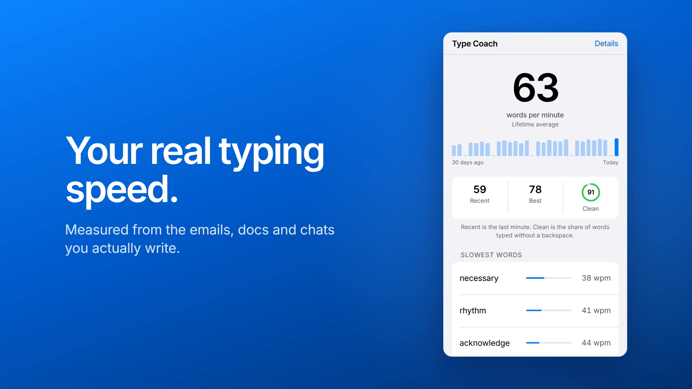

<div align="center">

# Type Coach

**Measure your real typing speed — not in a typing test, but in the emails, docs and chats you actually write.**

[](https://developer.chrome.com/docs/extensions/mv3/intro/)
[](#)
[](#)
[](#privacy)
[](#)
[](LICENSE)

[](store/demo.mp4)

<sub>Click the image to watch the 21 second launch video.</sub>

</div>

---

Typing tests tell you how fast you type *a typing test*. Type Coach measures the
typing you actually do all day, then tells you **which words slow you down and
which ones you keep having to fix** — the things worth practising.

## Features

- **Real-world speed.** Words per minute measured from ordinary typing anywhere
  in Chrome, using the standard five-keystrokes-per-word convention.
- **Idle never counts.** Only gaps under three seconds count as typing, so
  stepping away neither inflates nor deflates your number.
- **Your slowest words.** Ranked by how far below your own average each one
  falls, with an inline meter so the list reads at a glance.
- **Your most-corrected words.** The share of attempts where you had to
  backspace, so you can see which spellings you never quite get right.
- **Daily trend.** A bar per day, 14 in the popup and 30 on the dashboard, so
  progress is visible rather than assumed.
- **Clean rate.** The share of words typed without a single correction.
- **Light and dark.** Follows your system theme automatically.

## Privacy

An extension that watches keystrokes is, structurally, a keylogger. This one is
built so that it **cannot meaningfully leak what you type**:

| Guarantee | How |
|---|---|
| Sensitive fields are never observed | Password, one-time-code and payment fields are skipped by input type and `autocomplete` hint |
| Secrets cannot survive | Only letters (plus internal `'` and `-`), 2–20 characters, are kept. Anything with digits, symbols or odd casing is discarded on the spot |
| One-off text never appears | A word must recur **three times** before it is stored or shown |
| Your text cannot be reconstructed | Only aggregates are kept (`word → count, time, corrections`). The order you typed words in is never recorded |
| Nothing leaves your device | Data lives in `chrome.storage.local`. No server, no analytics, and the extension requests **no network permission at all** |

The only permission requested is `storage`.

## Install

### From the Chrome Web Store

Not published yet. The store link will appear here once it is.

### From source

```bash
git clone https://github.com/muq-s1d/type-coach.git
```

Then load it into Chrome:

1. Open `chrome://extensions`
2. Turn on **Developer mode** (top right)
3. Click **Load unpacked** and select the cloned `type-coach` folder
4. Type normally on any site, then click the toolbar icon

To update, `git pull` and press the **reload** ↻ button on the extension card.

> **After reloading the extension, refresh any open tabs before typing.**
> Reloading orphans the content script already running in those tabs, so nothing
> is recorded from them until the page is refreshed.

Content scripts cannot run on `chrome://` pages, the Chrome Web Store, or the
address bar, so test on an ordinary site.

## What the numbers mean

| Stat | Definition |
|---|---|
| **Average** | Lifetime characters ÷ 5 ÷ active typing minutes |
| **Recent** | The same over the last 60 seconds. Hidden below 4 words or a 3-second span, since tiny samples produce meaningless spikes |
| **Best** | The highest recent-window reading ever recorded |
| **Clean** | Share of words typed with no correction. Needs 20 words before it reports |
| **Active typing time** | Gaps between keystrokes under 3 seconds. Longer pauses are excluded entirely |

Corrections lower your speed, because the time spent backspacing counts while
the deleted characters do not. That is deliberate: it measures *net* speed, the
same thing a standard typing test reports.

## License

[MIT](LICENSE).

Typeface is [Inter](https://github.com/rsms/inter) by Rasmus Andersson, bundled
under the SIL Open Font License 1.1 (see `fonts/LICENSE.txt`).
